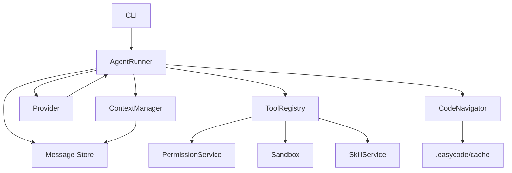

# Architecture

```text
CLI
 -> AgentRunner
 -> ContextManager
 -> Provider
 -> ToolRegistry
 -> PermissionService
 -> Sandbox
 -> MessageStore
```

## Modules
- `agent`: run loop, build/plan style, provider/tool iteration, final result.
- `tool`: tool definitions, schemas, permission keys, execution dispatch.
- `tool/code-navigator`: semantic navigation tools, repo-map cache, and code-index graph cache.
- `permission`: deny/ask/allow evaluation and pending permission requests.
- `context`: message selection, token estimation, summary insertion, compaction.
- `message`: model-facing messages and parts.
- `skill`: skill discovery and progressive prompt loading.
- `provider`: fake and Codex/Responses streaming normalization.
- `sandbox`: file and shell safety boundaries.


