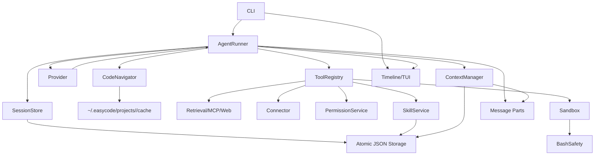

# Architecture

```text
CLI
 -> AgentRunner
 -> ContextManager
 -> Provider
 -> ToolRegistry
 -> PermissionService
 -> Sandbox
 -> SessionStore
```

## Modules
- `agent`: run loop, unified build/plan/goal execution, provider/tool iteration, subagent orchestration, final result.
- `agent/runner`: provider-turn loop, tool execution, context compaction scheduling, subagent execution, validation gates.
- `tool`: tool definitions, schemas, permission keys, execution dispatch.
- `tool/code-navigator`: semantic navigation tools, repo-map cache, and code-index graph cache.
- `permission`: deny/ask/allow evaluation and pending permission requests.
- `context`: message selection, token estimation, summary insertion, compaction.
- `prompt`: model-facing prompt templates and render helpers for agent, context, compaction, and text-tool protocol.
- `message`: model-facing messages and parts.
- `skill`: skill discovery and progressive prompt loading.
- `provider`: fake, DeepSeek, OpenAI, OpenAI-compatible streaming normalization plus readiness diagnostics.
- `sandbox`: file and shell safety boundaries.
- `bash-safety`: command risk classification layered before sandbox execution.
- `cache-policy`: prompt-cache segment labeling and cache metrics policy.
- `connector`: project-local connector tool configuration and execution bridge.
- `retrieval`: MCP, fixture-backed web search, live Tavily search, and bounded web fetch helpers.
- `settings`: session settings normalization, provider defaults, and token/step caps.
- `session`: session persistence, summaries, and bounded session-tail selection.
- `slash`: slash command parsing for goal/session/image/skill commands.
- `storage`: shared JSON backup recovery and atomic write helpers for durable project state.
- `tls-config`: provider TLS and certificate loading helpers.
- `ui`: timeline and TUI rendering surfaces.
- `index`: public barrel export for library consumers.
- `cli`: command-line startup, env loading, session selection, and interactive line loop.
- `dev/quality`: development-only quality tooling such as evals, APIx, cache benchmark, and gate orchestration; kept outside `src/` so runtime core stays focused.


