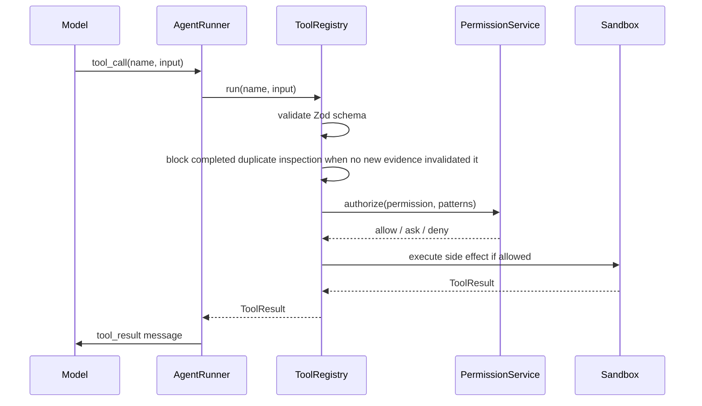
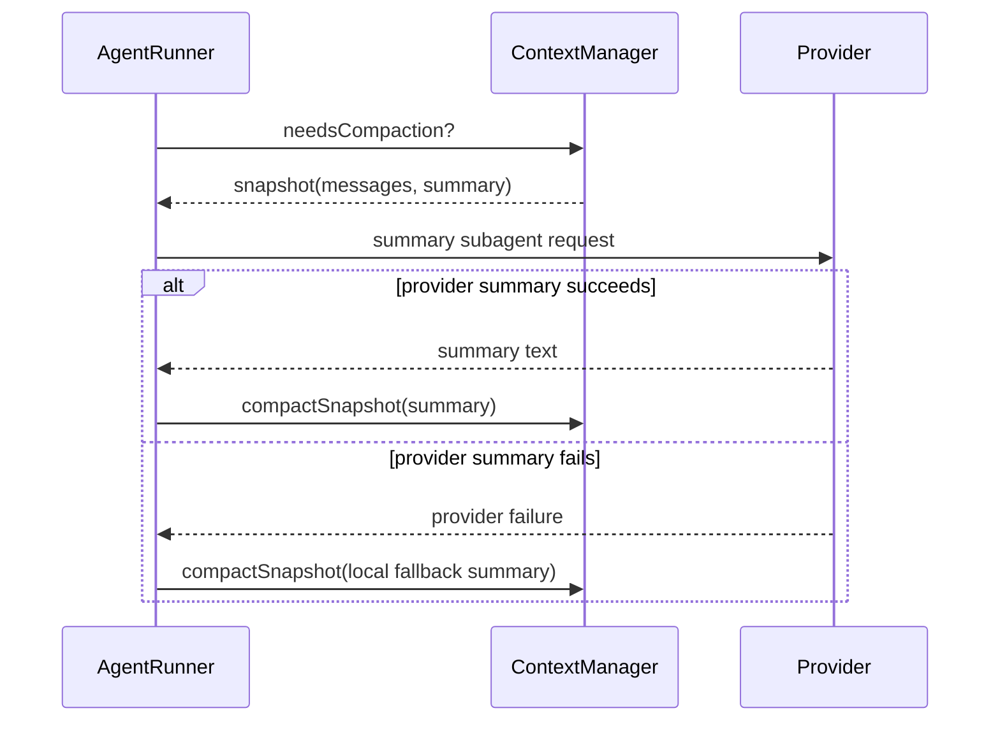
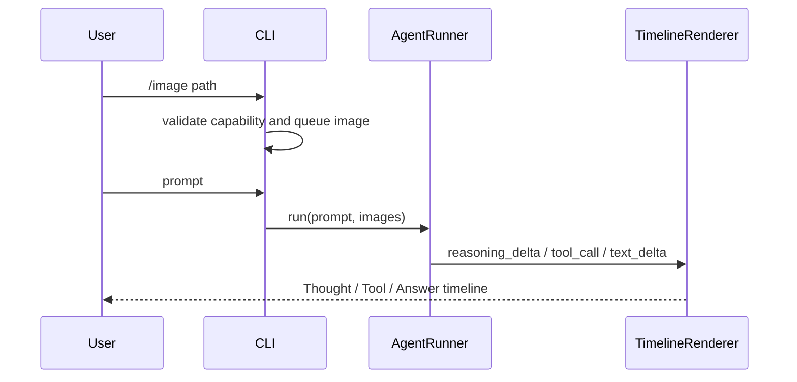

# Data Flow

```text
user input
 -> slash command parse or prompt dispatch
 -> optional image attachment merge
 -> message append
 -> context compose (agent protocol, active skills, pending skill loads, tools, ledger, summary, and bounded message suffix)
 -> provider stream
 -> UI event stream (non-logger timeline)
 -> model text/tool_call
 -> tool schema validate
 -> duplicate inspection check against completed prior tool results
 -> permission evaluate
 -> sandbox execute
 -> tool result message
 -> ledger refresh for current user trace and active capability state
 -> context length check
 -> compact if needed (provider summary first; local fallback summary if provider compaction fails)
 -> final answer
```






