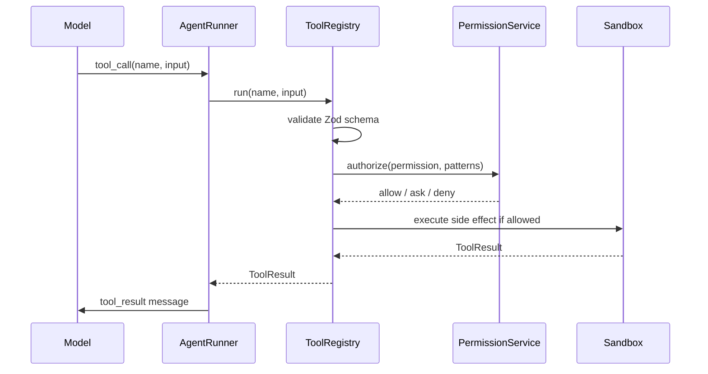

# Data Flow

```text
user input
 -> message append
 -> context compose (static agent/skill/tool descriptions on first provider turn only)
 -> provider stream
 -> model text/tool_call
 -> tool schema validate
 -> permission evaluate
 -> sandbox execute
 -> tool result message
 -> context length check
 -> compact if needed
 -> final answer
```


